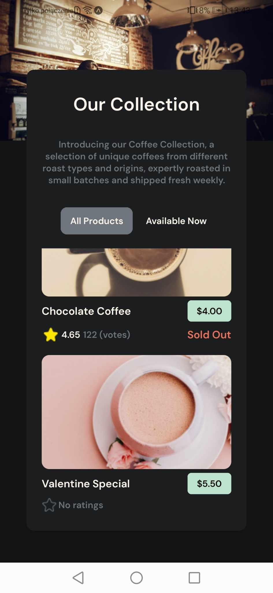
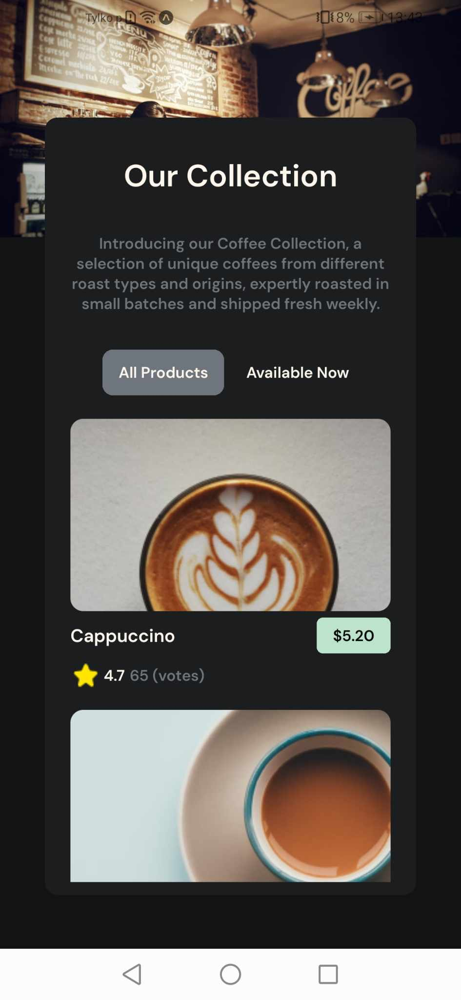

# Coffee listing implementation from devchallenges.io

- This project is simply displaying informations about menu from coffee shop. It allows to show all the products and only available ones.

## Technologies

 - React Native expo
 - JS, CSS


## API Reference
- Translator API from myMemory
#### Get all items


  - const response = await fetch ("url");

  - const data = await response.json();


## Deployment

To deploy this project run

```bash
  npm install
```
```bash
  npx expo start
```


## Overview
<p float="left">
 
 
 
</p>

